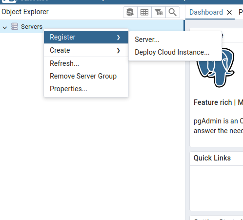
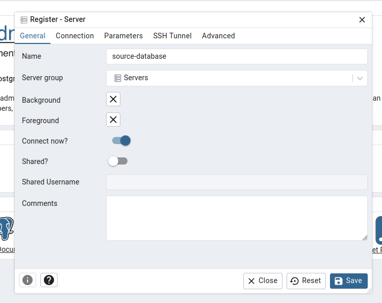
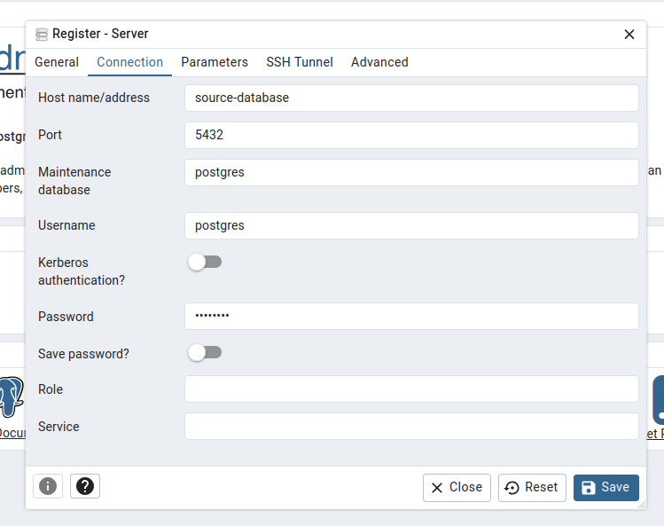
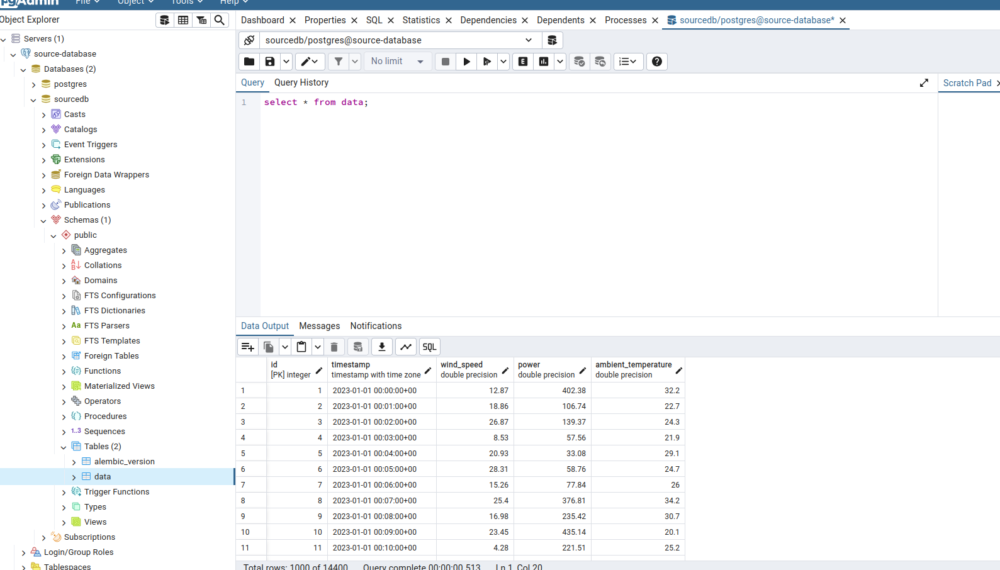

# ETL-PIPELINE

## Depedências
- Fastapi
- SQLAlchemy
- Httpx
- Pandas
- Postgres
- Alembic

## Instruções

- Execute o arquivo `docker-compose-databases.yml`:

```
docker-compose -f docker-compose-databases.yml up --build
```

- Em seguida, execute o arquivo `docker-compose-services.yml`:

```
docker-compose -f docker-compose-services.yml up --build
```

- As data usadas nos dados aleatórios gerados:

```
01-01-2023 
02-01-2023 
03-01-2023 
04-01-2023 
05-01-2023
06-01-2023 
07-01-2023 
08-01-2023 
09-01-2023 
10-01-2023
```

- Para executar o `script ETL`, execute o comando:

```
docker exec -it target-etl python etl_script.py 01-01-2023
```

- **OBS: O script ETL pode ser executado usando as datas mencionadas acima**

- Para verificar se os dados foram armazenados com sucesso:
    
    - Acesse o banco de dados `targetdb` através do container `target-database`:

    ```
    docker exec -it target-database psql -U postgres -d targetdb
    ```

    - No bash do `postgres`, execute a consulta e verifique se os dados retornam corretamente:
    
    ```
    select * from "data" d;
    ```

    - Para realizar uma consulta usando uma data específica:
        
    ```
    select * from "data" d 
    where "timestamp" between '2023-01-01 00:00:00' and '2023-01-01 23:59:59'; 
    ```

## Configuração do PgAdmin

- Caso queira acessar o banco de dados pelo pgadmin, siga as instruções abaixo:

    - Acesse a url [localhost](http://localhost:8081/)
        
        - Email: admin@admin.com
        - Senha: admin

        
    
    - Na tela do pgadmin, clique em register e servers 
    
        
    
    - Na configuração de conexão com o banco de dados sourcedb, siga as instruções abaixo:

        - General/Name: source-database
        - Connection/Host name: source-database
        - Port: 5432
        - Username: postgres
        - Password: postgres

        
        
        

    - Em seguida clique em save. Caso a configuração funcione, será possível realizar as consultas normalmente

        

    - Para a configuração do banco de dados targetdb (Repetir o mesmo processo acima):

        - General/Name: target-database
        - Connection/Host name: target-database
        - Port: 5432
        - Username: postgres
        - Password: postgres